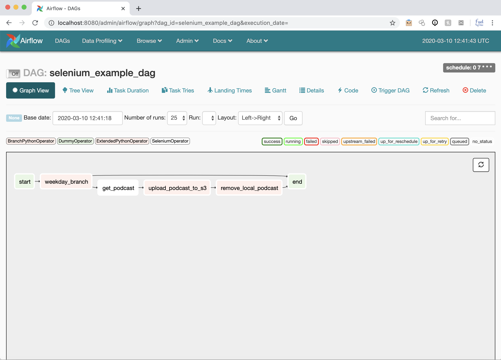

  Job execution Airflow DAG Selenium Webscaper
===
   Run Job and download mp3 content of podcast BBC_Radio5 Wake Up To Money

     Execute installation with automated docker-composer

        $ bash -x get-docker-compose-Selenium-executor.sh


  Selenium Plugin
===

   


  Imap Plugin
===

The purpose of this plugin is to use the Internet Message Access Protocol (IMAP) to retrieve email messages from a given mail server.

   
                                                
   


## Creating a connection

To create an IMAP connection using the Airflow UI you need to open the interface > Admin dropdown menu > click on 'connections' > create. The connection needs to be of the form:
* Conn Id: Your connection id
* Host: This is the IMAP server url
* Login: Your email address
* Password: Your email password, this may not be the same as your everyday email password depending on your mail server

## Hooks

The hook is called IMAPHook and can be instantiated with the relevant Airflow connection id.

The hook has a series of methods to connect to a mail server, search for a specific email and download its attachments.

```python
from airflow.hooks import IMAPHook

hook = IMAPHook(imap_conn_id='imap_default')
```

## Operators

### IMAPAttachmentOperator

This operator downloads the attachement of an email recieved the day before the execution date within the airflow context and saves it to a local directory.

```python
op = IMAPAttachmentOperator(
    imap_conn_id='imap_default',
    mailbox='mail_test',
    search_criteria={"FROM": "noreply@example.com",
                     "SUBJECT": "daily_report"},
    local_path='',
    file_name='',
    task_id='imap_example')

op.execute(context={'yesterday_ds': '2019-08-04'})

```

  Requirements
===
   Setup your linux machine follow links for [docker](https://github.com/jpacerqueira/Jupyter_Spark_H2O_Kafka_Client_Setup/blob/master/my_docker_wsl/install-docker.sh)
   and [docker-compose](https://github.com/jpacerqueira/Jupyter_Spark_H2O_Kafka_Client_Setup/blob/master/my_docker_wsl/install-docker-compose.sh)

  Information in Article
===
   Follow source selenium DAG article in [towards datascience link](https://towardsdatascience.com/selenium-on-airflow-automate-a-daily-online-task-60afc05afaae)

